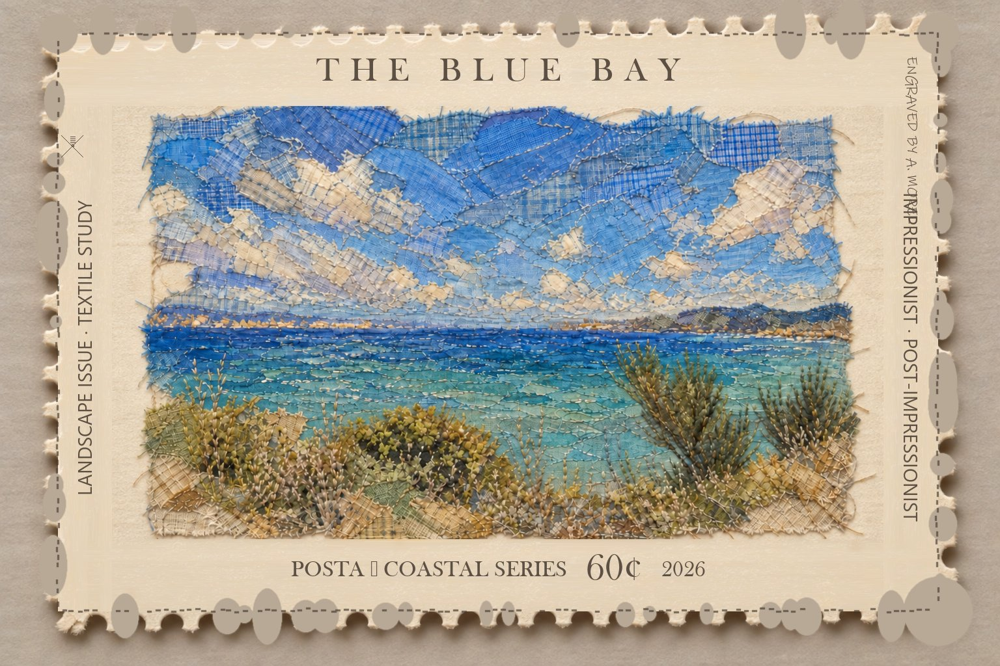

# stamp-plate

> **Turn a landscape photo / fabric-collage artwork into a realistic postage stamp — one image in, one stamp out.**
> 把一张风景图（照片或布艺拼贴作品）做成一枚可以拿在手里的真实感邮票：**一图换一票**。



## 快速开始（三步）

```bash
# 1) 组装整条提示词（零 Python）：模板唯一真源 references/stage2_template.txt
#    + 主题参数预设 themes/*.json → 按替换表机械替换 13 个占位符
#    （替换表与分段文本预设全文见 references/prompts.md 阶段 2）
#    主题键：coastal / hilltown / avenue / meadow / snow / lake / desert /
#            garden / coastal_cn（自定义景仿照 themes/*.json 写一个）
#    照片输入 → 保真段用 P 版 ｜ 新票 → 删邮戳段 ｜ 叠字 → 末尾追加 STRICT 段

# 2) 喂给图生图模型：只喂这一张参考图、n=1、size 1536x1024
#    （喂两张会稳定 upstream_error；多图先手动拼合成一张）

# 3) 按质量门清单目检：五区文字零重叠 / 拼写放大 2× 逐字核对 / 齿孔 /
#    纸边 / 景物保真（判据见 SKILL.md「质量门」）
```

## 工作原理（一条提示词一次成型）

整枚邮票——纸、齿孔、针脚框、**全部排版文字、邮戳**——由**一条完整提示词**直接生成，
**零 Python、零代码文件**：纯提示词 + 参数预设（`themes/*.json`），模板即全部逻辑。
提示词按五段式拼装
（模板见 `references/stage2_template.txt`，用法见 `references/prompts.md` 阶段 2）：

1. **保真** — `KEEP THE ARTWORK pixel for pixel`：景物 / 布片 / 线头一个像素都不动
2. **邮票纸** — 齿孔写成打孔物理过程（`punched clean through, each hole showing the
   grey tabletop through it`）+ 纸边宽度（上下 12% / 左右 9%）+ 微倾斜 + 软投影
3. **材质图形** — laid 纸纤维 + 贴画缘一圈深色虚线跑针框（右下织入细微盖销波线）
   + 底部雕刻装饰信息条 + 随景色变化的迷你彩蛋
4. **★ 排版规格** — 五区版式逐区给出「字符串加引号 + 位置 + 限长 + 字号比例 + 方向」
   （顶部 AIR MAIL/POST 铭文按画面内容二选一、序列编号每次随机）
5. **禁止项** — `no overlapping or colliding text` 打头

### A/B 串角色（「禁止自造词」的客观判据）

| 类 | 字段 | 规则 |
|---|---|---|
| **A 固定串** | `side_left / engraver / postmark_name / postmark_date / year / inscription(二选一)` | 模板自带虚构专名视为已授权：原样用、不改写、日期间隔点一律连字符；序列编号 `No.` + 6 位随机数字，纯数字不参与判据 |
| **B 专名位** | `title / series / values(随机取一，中文单位) / side_right / eggs` | 随景色重写，重写后加引号锁死 |

提示词里每个字符串必须逐字来自 A∪B 的引号原串。

### 五区版式（防叠字的核心）

| 区域 | 内容 | 位置与限长 |
|---|---|---|
| 顶部 | 铭文 `AIR MAIL`/`POST` + 标题 `THE BLUE BAY` | 同一竖列居中：铭文在上（~1.4% 画幅高），按画面内容二选一 |
| 底部 | `POSTA - COASTAL SERIES` + 面值 + `2026` | 同一行水平居中，面值放大约 1.4×，每次出票从主题 `values` 数组随机取一（单位分/元） |
| 底部·下沿 | 雕刻装饰信息条 + 序列编号 `No. NNNNNN` | 底行正下方：细雕纹横条不带字 + 序列号居中，各层间距 ~1%，安静不抢眼 |
| 左 | logo + `LANDSCAPE ISSUE - TEXTILE STUDY` | logo 占左上 1/4；文字限中部 50%，自下而上 |
| 右·上段 | 署名 `ENGRAVED BY A. MOREL` | 仅右上 1/4 区 |
| 右·中段 | `IMPRESSIONIST - POST-IMPRESSIONIST` | 仅中部 50% 区，**与上段间隔 ≥5% 画幅高** |
| 右下 | 圆形邮戳（信销样） | 半透明，只压画面右下角，不碰任何文字 |
| 边框 | 细微盖销波线 | 织入虚线针脚框右下段，极淡半透明、无文字，与边框融为一体 |

### 实测翻车点 → 提示词修法

| 翻车 | 修法 |
|---|---|
| 右侧两段竖排叠字 | 写死 `two separate zones … a clear gap of at least 5 percent of the image height separates them; their zones never touch` |
| 间隔点 `·` 变方框 | 字符串改用连字符：`POSTA - COASTAL SERIES` |
| 模型自造词 / 拼错 | 文字内容给**确切字符串并加引号** |
| 齿孔画成灰团 | 重申 `punched clean through` + 孔透出桌面 |
| 景物被顺手重画 | 保真段放最前 + `copy the artwork pixel for pixel` |

## 仓库结构

```
stamp-plate/
├── SKILL.md                     # 完整技能定义：路由 / 工作流 / 五区版式规格 / 质量门 / 失败修正决策树
├── themes/                      # 主题库（9 套 JSON：8 类景色 + CJK 侧串版；面值单位一律中文 分/元）
├── references/
│   ├── prompts.md               # 提示词模板库（★2 用法与判据 / 基础 / 边框支线 / 彩蛋）
│   └── stage2_template.txt      # ★一次成型模板唯一真源（占位符版）
└── demo/                        # 示范图（最终样式基准）
```

> 完整 examples（各版式成图、矩阵对比、细节放大）随 WorkBuddy 技能包分发，不在此仓库。

## 亮点经验（详见 SKILL.md）

- **齿孔必须写成物理过程**（punched clean through + 孔内阴影 + 纤维毛边），
  否则一眼数字模切
- **文字排版在提示词里完成**：五区版式 + 引号字符串 + 连字符隔点，可做到零叠字零错字
- 保真段必须放最前并写 `pixel for pixel`——排版段在后，模型会趁排版顺手重画画面
- 微倾斜 + 软投影让齿边清晰度从 12.3 → 34.0

## License

**仅限个人、非商业使用**。不允许销售、收费生成、订阅服务、代做、咨询、培训、SaaS/API、公司或客户项目及其他商业化用途。任何商业使用均须事先获得 [sailor20](https://github.com/sailor20) 的明确书面许可。

<div align="center">

**贴上风景，寄出片刻。**

AI-GENERATED POSTAGE STAMPS · 2026

</div>
